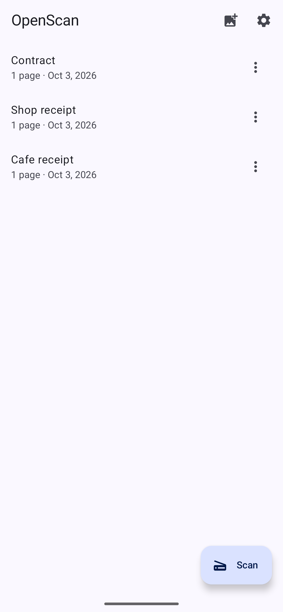
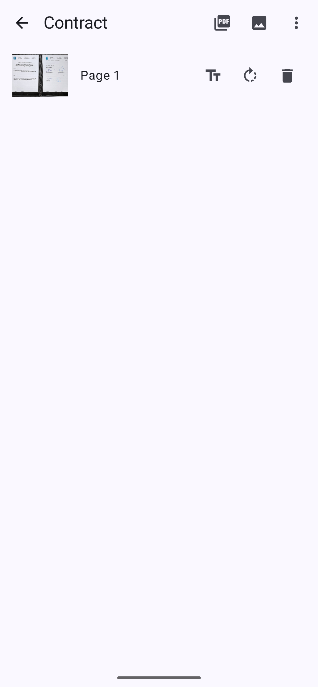
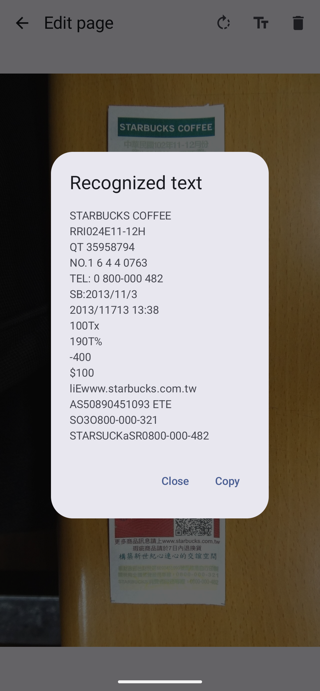
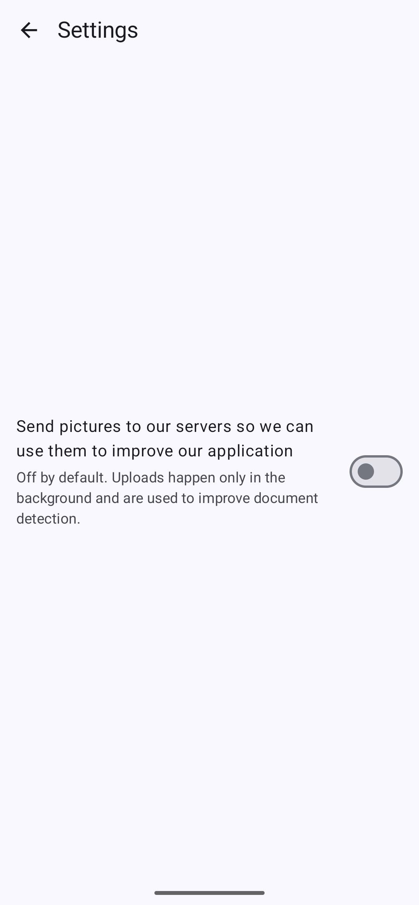

<div align="center">
  

  <h1>OpenScan</h1>

  <p><b>The free and open-source CamScanner alternative for Android.</b><br/>
  Scan anything, get a clean, readable PDF — <b>never watermarked</b>.<br/>
  No ads. No account. No tracking. Your scans never leave your phone.</p>

  <p>
    <a href="https://github.com/alexeygrigorev/openscan/actions/workflows/ci.yml"></a>
    <a href="https://github.com/alexeygrigorev/openscan/releases"></a>
    <a href="LICENSE"></a>
    
    
  </p>

  <table>
    <tr>
      <td align="center"><br /><sub><b>Document library</b> — batch import, rename, page counts</sub></td>
      <td align="center"><br /><sub><b>Pages & export</b> — share as PDF or JPEG, never watermarked</sub></td>
      <td align="center"><br /><sub><b>On-device OCR</b> — copy text, fully offline</sub></td>
      <td align="center"><br /><sub><b>Private by default</b> — sharing scans is opt-in</sub></td>
    </tr>
  </table>
</div>

---

## Why OpenScan?

CamScanner's free tier stamps its logo on every page and charges ~$50/year to remove
it. Microsoft Lens was retired in March 2026. OpenScan does what those apps do —
clean, straight, readable PDFs from your camera — and gives it away for free,
forever, under the Apache-2.0 license.

| | OpenScan | CamScanner (free) |
|---|---|---|
| Watermarks on output | **never** | on every page |
| Ads | none | yes |
| Account required | none | required for full features |
| Price | free, open source | subscription to remove limits |
| Works offline | **yes** (default) | mostly no |
| Auditable | every line (Apache-2.0) | no |

## Features

- **Multi-page capture** with automatic edge detection, perspective crop and
  retake UI (ML Kit document scanner; the Play-services module may need a
  one-time download on device)
- **Batch import** from the gallery — pick as many pages as you like
- **Document library** with rename, delete and page counts
- **Page editing** — rotate, delete, reorder
- **Share as PDF** (multi-page) and **as JPEG** — output is never watermarked
- **On-device OCR** — recognize text and copy it, fully offline
- **Private by default** — fully offline unless you opt in to sharing scans
  (see below)

The full roadmap lives in [docs/FEATURES.md](docs/FEATURES.md): merge documents,
password-protected PDFs, e-signature placement, ID-card and whiteboard modes.

## Install

Grab the latest signed APK (or Play-store AAB) from the
[Releases page](https://github.com/alexeygrigorev/openscan/releases) and install it
on any Android 8.0+ device. The app is intentionally tiny (~2 MB of code): the
heavy lifting — scanner UI and OCR models — is provided on-device by Google Play
services.

## How good is the output?

We hold OpenScan to a published benchmark instead of vibes:
an 82-photo corpus of receipts, invoices, contracts, ID cards and documents shot
in the wild drives both unit tests and an on-device instrumented eval
([docs/EVALUATION.md](docs/EVALUATION.md)). Two things are verified on every
change:

1. pages are detected and cropped correctly (ground-truth corner IoU is tracked
   per image), and
2. **every exported PDF has a clean text layer** — i.e. no watermark.

## Privacy

OpenScan collects nothing by default: no analytics, no crash reporting, no
account, and — unusually for a scanner — **no camera permission** (scanning is
delegated to the OS scanner module).

The only network feature is an explicit opt-in toggle in Settings —
*"Send pictures to our servers so we can use them to improve our application"* —
which is **off by default**. While it is off, nothing is ever transmitted, and
uploads are fire-and-forget with no retry queue, so switching it off stops all
transfers immediately. Opted-in uploads are used only to improve document
detection and are deleted after 90 days. Verify the merged manifest yourself:

```bash
aapt2 dump badging app-release.apk | grep uses-permission
# uses-permission: name='android.permission.INTERNET'
# uses-permission: name='io.github.alexeygrigorev.openscan.DYNAMIC_RECEIVER_NOT_EXPORTED_PERMISSION'
```

Details — including exactly what an opted-in upload contains — in
[docs/PRIVACY.md](docs/PRIVACY.md).

## Build

Requirements: JDK 17+ (21 recommended), Android SDK with platform 36.

```bash
./gradlew :app:assembleDebug        # debug APK
./gradlew :app:testDebugUnitTest    # unit tests
./gradlew connectedDebugAndroidTest # batch pipeline E2E (device/emulator needed)
```

Version numbers are derived from git tags — `app/build.gradle.kts` reads the
`VERSION_CODE` / `VERSION_NAME` environment variables, which release CI fills via
`scripts/derive-version.sh`. See [docs/RELEASING.md](docs/RELEASING.md) for the full
release process (tag → one workflow → GitHub Release with signed artifacts).

## Documentation

| Doc | What's inside |
|---|---|
| [docs/FEATURES.md](docs/FEATURES.md) | the researched feature set and roadmap |
| [docs/RESEARCH.md](docs/RESEARCH.md) | the CamScanner teardown behind it |
| [docs/EVALUATION.md](docs/EVALUATION.md) | the photo benchmark and detector versions |
| [docs/VERIFICATION.md](docs/VERIFICATION.md) | how each feature is proven to work |
| [docs/PRIVACY.md](docs/PRIVACY.md) | data flows, permissions, the opt-in toggle |
| [docs/RELEASING.md](docs/RELEASING.md) | tag → signed release process |
| [docs/PLAY_LISTING.md](docs/PLAY_LISTING.md) | the Google Play store listing text |

## Contributing

Issues and PRs are welcome. Keep the promises: no watermarks, no ads, no
tracking, no new permissions without a very good reason.

## License

[Apache-2.0](LICENSE) — © 2026 Alexey Grigorev
